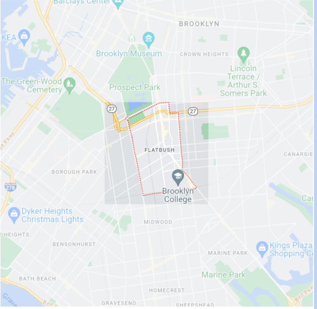

# Flatbush

***Best known for busy commercial districts and streets featuring Victorian era mansions.*** 

## ZipCodes

### Primary Zip Code

- 11226

### H3 Other Zip Codes Included

- 11203
- 11210
- 11225

## Demographics

### Age Range

**Median Age:** 35.4 years old
- Under 9: 11.12%
- 10 to 19: 10.63%
- 20 to 29: 16.47%
- 30 to 39: 19.28%
- 40 to 49: 12.93%
- 50 to 59: 11.78%
- 60 to 69: 9.78%
- 70 to 79: 5.41%
- 80 and Over: 2.59%

### Male to Female

**Male:** 45.67%
**Female:** 54.33%

### Race and Ethnicity

- White: 13.67%
- Black: 63.94%
- AIAN: 0.21%
- Asian: 2.89%
- Hispanic: 14.81%
- Two+: 3.73%
- Other: 0.74%

### Education

- Less Than High School: 12.97%
- High School Degree: 32.37%
- Some College: 21.75%
- Bachelor's Degree: 20.48%
- Post-Grad: 12.44%

### Income

- Income Per Capita: $34,323
- Median Household Income: $66,173

# NYC Clean Heat

  The NYC Clean Heat Program is a program that aims to provide people with improved heat and cooling that comes from a renewable energy source as to not harm the environment.The program aims to minimize the use of No. 4 fuels, a residual fuel used for commercial burner installations, and No. 6 fuels, a heavy fuel used for power plants and overseas operations that can prove to be harmful to sea life. The NYC Clean Heat Program has initialized various plans to assist in protecting the environment. In order to help stop the increase in pollution coming from boilers, the DEP boiler registration was set up to monitor and minimize soot pollution entering the air. Additionally, the Greener, Greater Buildings Plan was organized as a set of laws aiming to regulate a set of buildings responsible for 45% of the city’s energy usage. Part of helping buildings become more energy efficient comes from creating a plan to properly implement more efficient and environmentally friendly energy sources that will be of a benefit to both the buildings owner and the environment.

# NYC Emisions

  The majority of NYC’s greenhouse gas emissions come from the combustion of fossil fuels and over 40% of all energy consumed is used for heating and cooling systems. As 75% of the city’s GHG emissions are related to buildings, heating and cooling directly affect over 30% of the city’s carbon footprint. In order to combat this, New York passed a bill to ban the use of fossil fuels in new buildings, effective in 2026 for buildings under seven stories. For bigger buildings, the ban will take effect in 2029. Gas stoves and furnaces will be banned, and construction will have to include all-electric alternatives. Moreover we see the effects of the strides that specific boroughs like Brooklyn have been trying to take to reduce greenhouse gas emissions. For instance, the Brooklyn Public Library has reduced their emissions of 28 buildings by 16%. By using sustainable methods such as using 45 LED lighting retrofits; the installation of 22 smart building monitor systems which manage lighting, heating and air conditioning; and 30 HVAC upgrades in design or construction, the Brooklyn Public Library was able to achieve a 40% reduction in its greenhouse gas emissions, saving 3,500 metric tons of carbon dioxide. In addition, the Brooklyn Public Library encourages sustainability in the process of reducing energy and combating climate change to the public as well, by allowing Patrons to borrow a Home Energy Audit Toolkit (HEAT) with their library cards. The kit provides a thermal imaging camera and an electricity usage monitoring system, educating the public while also helping families identify ways to reduce energy consumption.

